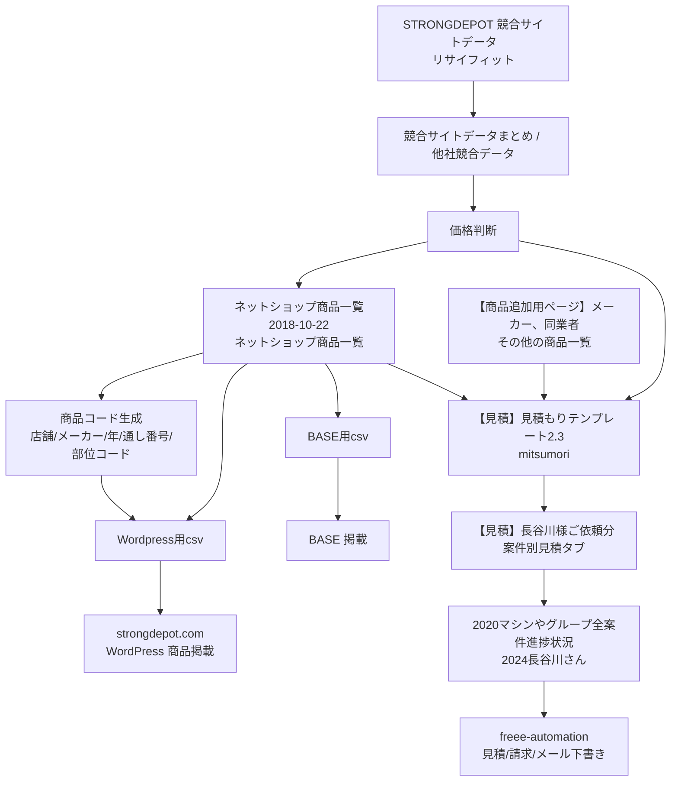

# 現行システム全体像（中古マシン販売システム）

最終更新: 2026-04-04

## 目的

現行の中古マシン販売業務を棚卸しし、WordPress を使わない次世代システムへ移行するための土台として、現行の主要データ流れ・重要スプレッドシート・現時点の問題点を整理する。

## 現行システムの全体像

現行は単なる商品掲載サイトではなく、商品マスタ、見積、案件進捗、競合価格収集、サイト掲載用データ生成が Google スプレッドシートと GAS を中心に連動する業務システムになっている。

## 主要スプレッドシート

| 区分 | スプレッドシート名 | ID | 位置づけ |
|---|---|---|---|
| 商品マスタ本体 | ネットショップ商品一覧2018-10-22 | `1KqOnN5eGh0i_DNRnpMHg9fqnR0DdVNeLEgui7lku3qk` | 商品マスタ、商品コード、WordPress/BASE 出力、配送・買取・委託周辺を持つ中核候補 |
| 商品マスタ旧コピー | ネットショップ商品一覧2024 | `10Zp4e5BHLETAukN0fWfAmqWgBg5ptl5V4mgYvuOpFsg` | 旧コピー/比較用候補 |
| 商品マスタ旧コピー | ネットショップ商品一覧2018-10-22 のコピー | `1pceh0YsHVGbBf1PS3OjUmy_Z2OtpMzayf8euAiJNIwY` | 旧コピー候補 |
| 商品マスタ旧バックアップ | ネットショップ商品一覧3.24bk | `1MbQbJdNWFSmQs24kfJnv06Eh62yt3nGIj-zAqnafxFs` | バックアップ候補 |
| 商品登録アプリ試作 | 中古マシン販売管理アプリ | `1tZEHQU45zTDKDm1lWYC-wob2SHuK4DNdnqi08k1mIog` | 単一 `used` シートの簡易管理表。現行本流かは要確認 |
| 見積テンプレート本体 | 【見積】見積もりテンプレート2.3 | `1LAbKaOuuOKKLByXCLGurjVBglwCTOpdfomC2x8u6Yaw` | 見積入力、運搬費、値引き、修理原価、送付状、代理販売等を含む |
| 見積テンプレート派生 | 【見積】見積もりテンプレート2.3freee連携API | `1IUb0KIWjsC47EIqW3gHfAtoDgrB5v7DsZ6eF8LLuk-0` | freee 連携前提の見積テンプレート派生版 |
| 案件別見積集約 | 【見積】長谷川様ご依頼分 | `1jcGEX01hQtJiMqnoGBRLOpN0LswItFqjkBRUZfPs3kM` | 顧客・案件別見積タブを多数保持 |
| 案件進捗・見積台帳 | 2020マシンやグループ全案件進捗状況 | `1TMKQO4zYwk1kWgkfoCR4K7jTeIxNxsS1B8uh7t8nd2c` | 案件進捗、見積リンク、freee 連携、lines_json 作成 |
| その他商品マスタ | 【商品追加用ページ】メーカー、同業者 | `1oyelesEq-Hw2Nlr6nNdxqWoR6RsftvWyZw0b-uNUVyQ` | 見積B列から参照される、SD商品以外のメーカー/同業者商品マスタ |
| 競合価格収集元 | STRONGDEPOT 競合サイトデータ | `1w1P0bN8UFFNfUZfNvXPpocng2a5qQgBDdzyTtxXmhtc` | リサイフィット商品データ、画像URL、収集マニュアル |
| 競合集約/分類 | 競合サイトデータまとめ | `1AFHny62--RuL0jm3JZdM1zX4L-7oDf10i8HWA48pANE` | 競合商品の集約・メーカー分類・カテゴリ分類 |
| 競合中継 | 他社競合データ | `1Q-tzcfXmQ2rMbNOBi_o0KaUP8UV8Hp2ksBc1Skk1kt8` | `STRONGDEPOT 競合サイトデータ` を `IMPORTRANGE` する中継シート |

## 現行の主要データ流れ

## 業務フロー整理

### 1. 商品登録

- 主入力先は `ネットショップ商品一覧2018-10-22` の `ネットショップ商品一覧` と推測する。
- 商品名、説明、状態、店舗、仕入年、部位、カテゴリ、サイズ、重量、画像、原価、送料、売価、公開状態などを列で管理している。
- `中古マシン販売管理アプリ` の `used` シートにも簡易商品マスタがあるが、列数が少なく、現行本流か試作かは要確認。

### 2. 商品コード生成

- `ネットショップ商品一覧` の `新規自動生成商品コード` 列に `OOB116001AT` や `OOCY16003LG` のようなコードが入っている。
- `ルール` シートで以下のコード体系を管理している。
  - 店舗/地域コード: `大阪=OO`、`兵庫=HY` など
  - メーカーコード: `CYBEX=CY`、`ELEIKO=EL` など
  - 年コード: `2016=16` など
  - 連番
  - 部位コード: `胸=CH`、`脚=LG`、`その他=AT` など
- 推測だが `OOCY16003LG` は `OO + CY + 16 + 003 + LG` のように分解できる。
- ただし `ルール` シート上の説明に「メーカーコード 3桁」と見える一方、実データは2文字コードに見えるため、正式仕様は要確認。
- `ネットショップ商品一覧GAS.txt` の `createProductCode()` でも、商品コードは `店舗コード + メーカーコード + 年コード + 通し番号3桁 + 部位コード` の順で組み立てていることを確認した。
- 注意点として、店舗/メーカー/部位/状態/カテゴリのマスタが `ルール` シートだけでなく GAS 内の配列 `shops` / `makers` / `machines` / `bodyParts` / `productStatus` にもハードコードされており、さらにコメントでは GitHub リポジトリ `kohakuwebdesign/strongdepot-product-manager` の `Settings.php` も更新が必要と書かれている。つまり、現行は分類マスタがシート・GAS・PHPで三重管理になっている可能性が高い。

### 3. 商品出力データ生成

- `Wordpress用csv` シートで WordPress 投稿/商品用の列へ整形している。
- `BASE用csv` シートで BASE 用の商品CSV形式に整形している。
- `Wordpress用csv` には `post_id`、`product_code`、`post_title`、`product_price`、`tax_products-category`、`post_status` など、明確に WordPress 前提の項目が残っている。

### 4. サイト反映

- `Wordpress用csv` の先頭行に `https://strongdepot.com/wp-login.php` があり、WordPress 管理画面への反映を前提にしている。
- `ネットショップ商品一覧GAS.txt` の `sendHttpPost()` では、`doGet()` / `getData('ネットショップ商品一覧')` で商品一覧を JSON 化し、`https://machine-group.net/strongdepot-product-manager/generate.php` へ HTTP POST している。
- したがって、現行のサイト反映は `Wordpress用csv` だけでなく、GAS から外部PHPへ商品JSONを投げる経路もあることが確認できた。
- ただし `generate.php` の内部で WordPress へどう反映しているかは今回未確認のため、新システム移行時は PHP 側コードも別途棚卸しが必要。

### 5. 見積作成

- `【見積】見積もりテンプレート2.3` の `mitsumori`、`見積書(簡易)`、`運搬費計算`、`値引きルール`、`修理・原価+利益 `、`ヤマト便計算シート` などが見積業務を分担している。
- `mitsumori` には `SD商品コード`、メーカー、商品名、商品コード、定価、個数、合計、値引き、運搬設置費、原価、送料、5%〜75%引き列があり、商品コード起点で見積行を組む構造に見える。
- `見積書(簡易)` では `D列*F列`、`SUM(G15:G27)`、`消費税=小計*0.1` のようなセル式で合計計算している。
- `値引きルール` は台数別の標準値引きとして `1台=0%`、`2台=5%`、`3〜4台=10%`、`5台以上=15%` を保持している。
- `2020マシンやグループ全案件進捗状況` の `2024長谷川さん` タブでは、案件行ごとに見積リンク、請求金額、支払い、利益、freee `partner_id`、`lines_json`、`quotation_id`、Gmail Message-ID を管理している。
- ローカルコード `freee-automation` はこの `2024長谷川さん` タブと `lines_json作成` タブに紐づいている。
- `見積もりテンプレートGAS.txt` により、`mitsumori` を含むタブで A列/B列/G列/J列/K列を編集すると `myOnEdit(e)` が動き、見積行の自動展開と再計算を行うことが確認できた。
- A列のSD商品コードは `ネットショップ商品一覧2018-10-22` の `ネットショップ商品一覧` を参照し、B列のその他商品コードは別ブック `【商品追加用ページ】メーカー、同業者` の `その他の商品一覧` を参照する。
- 見積側の注意点として、商品名文字列に `（現状価格xxx円）` を埋め込み、後段の `setEachSum()` でその文字列を `split('現状価格')` して価格を復元しているため、商品名フォーマットが変わると計算が壊れやすい。

### 6. 競合価格収集

- `STRONGDEPOT 競合サイトデータ` の `リサイフィット` に、収集日時、URL、商品名、メーカー、整備価格、現状価格、商品説明、画像URL、カテゴリが蓄積されている。
- `マニュアル` シートに「シート名は変更しない」「画像は Drive フォルダへ保存」「ファイル名は `id_画像番号`」などの運用ルールがある。
- `競合サイトGAS.txt` により、`https://recyfit.com/products/` の一覧ページから詳細URLを取り、各商品ページの HTML を `Parser` ライブラリでパースし、最大20件の新着データを `リサイフィット` シートへ追記していることが確認できた。
- 画像は最大3枚まで取得し、Drive フォルダ `1Q0vGVu2N8Ouq8us0JIMSaH1oCdHVLiZl` に `商品ID_画像番号` という名前で保存している。
- `他社競合データ` は `IMPORTRANGE` で `STRONGDEPOT 競合サイトデータ` を参照する中継シート。
- `競合サイトデータまとめ` はターゲット一覧と分類用途に見えるが、`メーカー分類` シートのメーカー列に `#ERROR!` が出ており、現行品質に問題がある可能性が高い。

## 現行の問題点

| 問題 | 内容 | 影響 |
|---|---|---|
| WordPress 前提構造が商品マスタに混在 | `Wordpress用csv` や WordPressカテゴリ列が中核ブック内にある | 新システムへそのまま持ち込むと設計が旧CMSに引きずられる |
| 1ブック多責務 | 商品マスタ、CSV出力、買取、委託、配送説明、ルールが同居している | 変更影響範囲が広く、不要タブ整理や権限制御が難しい |
| 列位置・固定セル依存が強い | 見積テンプレートや進捗台帳で `G12`、`Q列`、`SUM(W2:W99)` など固定参照が多い | 列追加や並び替えで壊れやすい |
| 見積ロジックが分散 | `mitsumori`、`見積書(簡易)`、案件別見積タブ、`lines_json作成` に計算/転記が分かれている | どこが正本か判断しづらく、再構築時に仕様漏れしやすい |
| 競合分類シートにエラー | `競合サイトデータまとめ` の `メーカー分類` で `#ERROR!` | 競合分析の自動化品質が不安定 |
| 旧リンク切れ | `2020マシンやグループ全案件進捗状況` の `リンク` タブにある旧見積テンプレートID `1ZM5veZcu-WGifslyCRkBtQwjigSUiAccqvDOypkZ_zs` は 404 | 参照先の棚卸しなしに移行すると欠損が残る |
| scriptId/トリガー実体が未確定 | GASコード内容はテキストで確認できたが、Apps Script の scriptId、デプロイ、インストール済みトリガーID は未確認 | どのブックにどの版のスクリプトが紐づくか、停止/移行順序の確定がまだできない |
| 分類マスタの三重管理 | 商品カテゴリ/メーカー/状態などが `ルール` シート、GAS配列、PHP `Settings.php` に分散している可能性が高い | どれか1箇所だけ更新すると表示や商品コードがずれる |
| 商品名文字列依存の見積計算 | 見積GASが `商品名（現状価格xxx円）` から文字列splitで単価を再抽出している | 商品名表記変更で計算が壊れる、データと表示が混ざっている |
| 競合収集がHTML構造と外部ライブラリに強依存 | `Parser` のタグ切り出し、`rawgit.com` からの `URI.js` eval、取得上限20件固定 | リサイフィット側HTML変更や外部ライブラリ停止で収集が止まる可能性 |
| 個人情報が業務シートに混在 | `お客様希望商品`、案件別見積、給与明細などに氏名・メール・支払い情報がある | 再構築時は閲覧権限とデータ分離が必要 |
| タイムゾーン不一致 | `ネットショップ商品一覧2018-10-22` のスプレッドシートタイムゾーンが `America/Los_Angeles` | 日付処理・GAS実行時刻にズレが出る可能性 |

## 今回わかったこと

- 商品マスタの中核候補は `ネットショップ商品一覧2018-10-22` で、商品コード、WordPress/BASE出力、マスタ定義を一体で持っている。
- 見積は `【見積】見積もりテンプレート2.3` 系と `【見積】長谷川様ご依頼分`、案件進捗台帳 `2024長谷川さん` が連動している。
- 競合価格データは `STRONGDEPOT 競合サイトデータ` が収集元で、別ブックが `IMPORTRANGE` で中継/分類している。
- 商品一覧GAS、見積テンプレートGAS、競合サイトGASの主要処理がテキストから確認でき、前回 `未取得` だった中核GAS責務の多くを埋められた。

## まだ不明なこと

- 商品マスタ本体・見積テンプレート本体・競合収集本体に紐づく Apps Script の scriptId、トリガー、デプロイ状態
- `machine-group.net/strongdepot-product-manager/generate.php` の内部処理と、WordPress DB/投稿への反映方式
- `中古マシン販売管理アプリ` が本番利用中か、試作/旧版か
- `ネットショップ商品一覧2024`、`ネットショップ商品一覧3.24bk`、コピー系ブックの現在の使用有無
- `その他商品一覧` や空白/旧版タブがどの程度現役か

## 次の一手

1. 対象スプレッドシートをブラウザで開き、`拡張機能 > Apps Script` からコンテナバインドGASの scriptId と `.gs` 一式を取得する。
2. `ネットショップ商品一覧2018-10-22` を正本候補として、商品コード生成仕様と WordPress/BASE 出力仕様を列単位で確定する。
3. `【見積】見積もりテンプレート2.3` と `2024長谷川さん` のどちらが見積計算の正本か、運用ルールを確認する。
4. 競合分類シートの `#ERROR!` 原因と、現在も業務判断に使っている列を確認する。

## すぐ着手できる実装候補

- 現行商品マスタ列を WordPress 依存列と業務マスタ列に分離した、新しい統合商品マスタ v0 のスキーマ定義
- 商品コード体系のマスタテーブル化と、コード生成仕様書の作成
- 見積行・案件・顧客・freee連携状態を分けた新データモデル案の作成
- 競合商品データの正規化テーブル案と、画像保存ルールの整理
