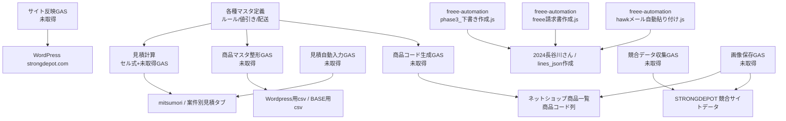

# GAS責務整理（中古マシン販売システム）

最終更新: 2026-04-04

## 前提

今回の調査でローカルに実体を確認できた GAS は `freee-automation` 配下のスクリプトであり、これは主に `2020マシンやグループ全案件進捗状況` の `2024長谷川さん` と `lines_json作成` を対象にしている。

一方で、商品コード生成、WordPress/BASE出力、見積テンプレート自動入力、競合サイト収集を担っているはずのコンテナバインドGASは、現時点で scriptId と `.gs` 本体をまだ取得できていない。

そのため本書は、`確認できたGAS` と `推測されるが未取得のGAS責務` を分けて整理する。

## 確認できたGAS

| GAS/ファイル | 主な責務 | 主な入力 | 主な出力 | 依存先 | 注意点 | 分類 |
|---|---|---|---|---|---|---|
| `freee-automation/hawkメール自動貼り付け.js` | Gmail から見積関連メールを取り込み、本文を案件台帳へ貼り付け、`lines_json作成` を開くメニューを提供 | Gmail スレッド、件名フィルタ、メール本文、台帳行 | `2024長谷川さん` の明細/本文系列、`lines_json作成` への導線 | `SpreadsheetApp`、`GmailApp`、`2024長谷川さん`、`lines_json作成` | 件名・本文形式・列位置への依存が強い可能性 | 見積自動入力 |
| `freee-automation/freee請求書作成.js` | freee API で取引先検索/作成、見積書作成、結果URLとIDを台帳へ書き戻す | `2024長谷川さん` の顧客名、`partner_id`、`lines_json`、案件情報 | `freee quotation_id`、見積URL、見積日/フラグ列 | freee API、`2024長谷川さん` | Q列/R列/T列など固定列前提。`lines_json` 不備で作成失敗する | サイト反映ではなく外部業務連携/freee連携 |
| `freee-automation/phase3_下書き作成.js` | freee 見積PDF取得、Gmail 下書き作成、PDF取得失敗時のURL案内本文生成 | `2024長谷川さん` の見積URL/顧客情報/メール情報、freee 見積ID | Gmail 下書き、PDF添付またはURL本文 | freee API、Gmail、`2024長谷川さん` | freee URL/ID と Gmail 宛先・本文生成が台帳列に依存 | 見積/請求送付補助 |

## freee-automation と案件台帳の対応

| 対象シート | 確認できた役割 | GAS側で重要そうな列/項目 |
|---|---|---|
| `2020マシンやグループ全案件進捗状況` / `2024長谷川さん` | 案件進捗、見積/請求/入金、freee連携状態、Gmail連携状態 | 状態、お客様、発生日、商談名・見積書リンク、顧客名、見積、請求書、入金確認、`partner_id`、`lines_json`、`quotation_id`、Gmail Message-ID、請求金額、支払い、利益 |
| `2020マシンやグループ全案件進捗状況` / `lines_json作成` | freee 明細 JSON を数式生成し、台帳Q列へ転記する補助シート | 転記先行番号、品目名、単価、数量、税率、生成JSON |

## 推測されるが未取得のGAS責務

| 責務分類 | 現行で担っているはずの処理 | 主な対象シート | 想定入力 | 想定出力 | 取得状況 | 注意点 |
|---|---|---|---|---|---|---|
| 商品コード生成 | 店舗/メーカー/年/連番/部位コードから商品コード自動生成、重複回避、行追加時の採番 | `ネットショップ商品一覧2018-10-22` / `ネットショップ商品一覧`、`ルール` | 店舗、メーカー、仕入れ年、部位、連番、状態 | `新規自動生成商品コード` | 未取得 | コード仕様を新システムで維持するには、このロジックの正確な再現が必要 |
| 商品マスタ整形 | 商品説明・検索キーワード・カテゴリ・公開状態・価格・画像列から掲載用データへ変換 | `ネットショップ商品一覧`、`Wordpress用csv`、`BASE用csv` | 商品マスタ行、ルールマスタ、公開状態 | WordPress/BASE向け整形行 | 未取得 | WordPress固有列と業務マスタ列を混同しないよう分離が必要 |
| サイト反映 | GAS から strongdepot.com/WordPress へ商品を一括反映、または CSV 出力後アップロード補助 | `Wordpress用csv`、`ネットショップ商品一覧` | 整形済み商品データ、画像、公開状態 | WordPress 側商品データ更新 | 未取得 | 実際に API 投稿か CSV 手動投入か未確認。ここが移行設計の重要論点 |
| 見積自動入力 | 商品コードからメーカー/商品名/価格などを見積行へ自動展開、案件タブ複製 | `【見積】見積もりテンプレート2.3`、`【見積】長谷川様ご依頼分` | SD商品コード、数量、見積テンプレート、商品マスタ | 見積行、帳票シート、案件タブ | 未取得 | 商品コード参照元がどのブックか、商品名文字列依存があるか要確認 |
| 見積計算 | 値引き、送料、運搬設置費、原価、税、合計、手数料、支払額を計算 | `mitsumori`、`見積書(簡易)`、`運搬費計算`、`値引きルール`、案件別見積タブ | 商品行、台数、距離、運搬条件、値引きルール、送料、原価 | 小計、消費税、合計、値引後価格、運搬費、利益 | 一部はセル式確認済み、GAS本体は未取得 | 固定行/固定列依存が強く、新システムではデータモデル側へ逃がしたい |
| 競合データ収集 | 競合サイトから商品名、価格、説明、画像、カテゴリを収集し、画像をDrive保存 | `STRONGDEPOT 競合サイトデータ` / `リサイフィット`、`マニュアル` | 競合URL、クロール結果、画像URL | 競合商品行、Drive画像ファイル | 未取得 | スクレイピング手段、実行頻度、規約/メンテ負荷を要確認 |
| 画像保存 | 商品画像/競合画像を Drive フォルダへ保存し、シートへURLを書き戻す | `ネットショップ商品一覧`、`STRONGDEPOT 競合サイトデータ` | 画像アップロード、外部画像URL、商品/競合ID | Drive ファイルURL、画像列 | 未取得 | 画像命名規則・フォルダ設計を新システムでも揃える必要あり |
| 各種マスタ定義 | メーカー、店舗、カテゴリ、状態、部位、配送/値引きルールの定義参照 | `ルール`、`値引きルール`、`配送について`、`全案件記入ルール` | コード表、選択肢、運用ルール | バリデーション、分類、計算条件 | 未取得/一部シートで確認 | コード表を業務マスタとして明示的に分離したい |

## 責務マップ

## 今回わかったこと

- ローカルで実体確認できた GAS は freee 連携・Gmail下書き・案件台帳転記が中心で、商品掲載本体や商品コード生成本体とは別領域だった。
- `2024長谷川さん` と `lines_json作成` は `freee-automation` の重要な入出力先で、列位置依存が強い。
- 商品コード生成、WordPress反映、競合収集、見積テンプレ自動展開は、存在が強く推測される一方で GAS 本体未取得のため、仕様確定には追加調査が必須。

## まだ不明なこと

- `ネットショップ商品一覧2018-10-22`、`【見積】見積もりテンプレート2.3`、`STRONGDEPOT 競合サイトデータ` に紐づくコンテナバインドGASの scriptId、ファイル一覧、トリガー
- WordPress反映が API 投稿か CSV 手動アップロードか、どのスクリプトが実行口か
- 商品コード生成の正式仕様、採番タイミング、再採番禁止ルール
- 見積テンプレート側で商品コードから商品情報を引く実装が GAS なのか数式なのか、その参照元

## 次の一手

1. 対象ブックの Apps Script エディタから `.gs` とトリガーを取得し、本表の `未取得` を埋める。
2. 取得した GAS を上記8分類へ再マッピングし、入出力シート・列・外部API・トリガー条件を追記する。
3. WordPress専用ロジック、商品マスタ汎用ロジック、帳票ロジック、freee連携ロジックを分離して、新システム側のサービス境界へ写像する。

## すぐ着手できる実装候補

- コンテナバインドGAS取得後に、そのまま責務一覧へ自動落とし込みできる `GASファイル名/関数名/対象シート/入出力/トリガー` 台帳テンプレートの作成
- `freee-automation` の固定列依存を一覧化し、新システムの案件・見積データモデルへ変換するマッピング表作成
- 商品コード生成/サイト反映/競合収集の未取得スクリプト調査チェックリスト作成
