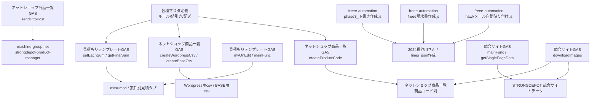

# GAS責務整理（中古マシン販売システム）

最終更新: 2026-04-04

## 前提

今回の調査で、ユーザー提供の以下3ファイルから主要GASのコード内容を確認できた。

- `C:\Users\pinsh\OneDrive\デスクトップ\ネットショップ商品一覧GAS.txt`
- `C:\Users\pinsh\OneDrive\デスクトップ\競合サイトGAS.txt`
- `C:\Users\pinsh\OneDrive\デスクトップ\見積もりテンプレートGAS.txt`

また、ローカルリポジトリには `freee-automation` 配下のスクリプトがあり、これは主に `2020マシンやグループ全案件進捗状況` の `2024長谷川さん` と `lines_json作成` を対象にしている。

ただし、提供テキストには Apps Script の `scriptId`、プロジェクト構成、インストール済みトリガーID までは含まれていないため、本書では `処理内容として確認できた責務` と `まだ実体IDが未確定な点` を分けて整理する。

## 今回追加で確認できたGAS

| GAS/ファイル | 主な責務 | 主な入力 | 主な出力 | 依存先 | 注意点 | 分類 |
|---|---|---|---|---|---|---|
| `ネットショップ商品一覧GAS.txt` / `mainFunc()` | 商品コード生成、WordPress用CSV生成、BASE用CSV生成を一括実行 | `ネットショップ商品一覧` | `新規自動生成商品コード`、`Wordpress用csv`、`BASE用csv` | `ネットショップ商品一覧2018-10-22` | 1クリックで複数成果物をまとめて上書きするため、責務が密結合 | 商品コード生成 / 商品マスタ整形 |
| `ネットショップ商品一覧GAS.txt` / `createProductCode()` | `店舗 + メーカー + 仕入れ年 + 通し番号3桁 + 部位` で SD商品コードを生成 | 通し番号、メーカー名、店舗、仕入れ年、鍛える部位 | `新規自動生成商品コード` 列 | `ネットショップ商品一覧`、GAS内配列 `shops`/`makers`/`buyYears`/`bodyParts` | `ルール` シートではなくGAS内配列も正として持っており、マスタが二重管理 | 商品コード生成 |
| `ネットショップ商品一覧GAS.txt` / `createWordpressCsv()` | 商品マスタを WordPress 用CSV列へ変換し、カテゴリ文字列・公開状態・商品状態を生成 | 商品コード、商品名、価格、割引後価格、店舗、サイズ、重量、説明、状態、公開状態、カテゴリ、トップページ掲載 | `Wordpress用csv` シート | `ネットショップ商品一覧`、GAS内配列 `shops`/`makers`/`machines`/`bodyParts`/`productStatus`/`postStatus`/`topPages` | `product_keyword` は元列ではなく固定値 `products`。`post_id = 通し番号 + 2000` の仕様あり | 商品マスタ整形 / サイト反映前処理 |
| `ネットショップ商品一覧GAS.txt` / `createBaseCsv()` | 商品マスタを BASE 用CSV列へ変換 | 商品名、商品説明、定価、トレーニングマシンの種類、BASE販売フラグ | `BASE用csv` シート | `ネットショップ商品一覧` | 価格は `定価 * 1.10`。画像列は空で出力。列名コメントは「いいえ」だがコードは `== 1` の行だけ出力しており仕様確認が必要 | 商品マスタ整形 |
| `ネットショップ商品一覧GAS.txt` / `sendHttpPost()` + `doGet()` + `getData()` | `ネットショップ商品一覧` 全行を JSON 化して外部PHPへPOSTし、サイト側へ反映 | `ネットショップ商品一覧` 全列 | `https://machine-group.net/strongdepot-product-manager/generate.php` へのPOST | `UrlFetchApp`、`machine-group.net/strongdepot-product-manager` | 店舗名に `大阪` を含む場合は一律 `大阪` へ丸める。反映先PHP内部の挙動は未確認 | サイト反映 |
| `ネットショップ商品一覧GAS.txt` / `hideRowsFunc()` + `showRowsFunc()` | `状態 = 売却済み` の行を非表示/再表示 | `ネットショップ商品一覧` の状態列 | 行の表示状態変更 | `ネットショップ商品一覧` | 引数 `keyword` を受けるが実装では `'売却済み'` 固定比較 | 商品マスタ運用補助 |
| `見積もりテンプレートGAS.txt` / `onOpen()` + `createTrigger()` + `myOnEdit(e)` | 初回メニュー追加、インストール型 onEdit トリガー作成、A/B/G/J/K列編集時に見積再計算を起動 | 編集イベント、アクティブシート | `myOnEdit` トリガー、見積行更新 | 見積ブック自身 | `onEdit` 直接ではなくインストール型トリガー前提。初回に Step.1 認証/Step.2 起動が必要 | 見積自動入力 / 見積計算 |
| `見積もりテンプレートGAS.txt` / `mainFunc(colStart)` + `setMatchDatas2()` | A列のSD商品コードから `ネットショップ商品一覧` を引き、見積行へメーカー名・商品名・商品コード・価格・原価・送料・割引額列を展開 | A列 SD商品コード | C〜M列、N〜AB列の割引額 | `ネットショップ商品一覧2018-10-22` / `ネットショップ商品一覧` | 商品マスタ列番号を固定で参照。商品名に `（現状価格xxx円）` を埋め込む | 見積自動入力 |
| `見積もりテンプレートGAS.txt` / `mainFunc(colStart)` + `setMatchDatas()` | B列のその他商品コードから別ブック `【商品追加用ページ】メーカー、同業者` を引き、見積行へ展開 | B列 メーカー/同業者側商品コード | C〜L列、N〜AB列の割引額 | `1oyelesEq-Hw2Nlr6nNdxqWoR6RsftvWyZw0b-uNUVyQ` / `その他の商品一覧` | 前回棚卸し対象外だった別ブック依存が判明 | 見積自動入力 |
| `見積もりテンプレートGAS.txt` / `setEachSum()` + `getFinalSum()` | 値引き後単価、行合計、小計、消費税、合計を再計算 | 商品名文字列、個数、値引き額、H列合計 | F列単価、H列行合計、末尾の小計/消費税/合計 | `mitsumori` 系シート | 商品名文字列の `現状価格` を split して価格復元しており、文字列形式に強く依存 | 見積計算 |
| `見積もりテンプレートGAS.txt` / `getShippingFee()` + `deleteShippingFee()` + `deleteSummary()` | K2/K3 の運搬設置費/送料を末尾行へ追加し、既存集計行を初期化 | K2、K3、既存の `送料` / `運搬設置費` / `小計` 行 | 末尾の追加費用行、再集計された合計行 | `mitsumori` 系シート | K2/K3 固定セル前提。K2とK3両方に値がある場合は `送料=K3` のみ採用 | 見積計算 |
| `見積もりテンプレートGAS.txt` / `isGoodSheet()` | 処理対象シートを `mitsumori` を含むタブ名に限定 | アクティブシート名 | 実行可否 | 見積ブック自身 | `見積書(簡易)` や日本語名タブは対象外。`mitsumori` 命名規約が実質必須 | 見積自動入力 / 見積計算 |
| `競合サイトGAS.txt` / `mainFunc()` | リサイフィット一覧から新着商品を最大20件取り込み、既存URL重複を除外して `リサイフィット` シートへ追記 | `https://recyfit.com/products/`、既存URL列、最終ID | `リサイフィット` への新規行 | アクティブスプレッドシート `リサイフィット` | `getArchivePageLength()` はあるが未使用。取得上限 `limit = 20` 固定 | 競合データ収集 |
| `競合サイトGAS.txt` / `getPageUrls()` + `getSinglePageData()` | 一覧HTMLから詳細URLを抽出し、詳細HTMLから商品名・メーカー・価格・説明・画像URLをパース | リサイフィットHTML | 収集日時、URL、商品名、メーカー、整備価格、現状価格、商品説明、画像URL配列 | `UrlFetchApp`、`Parser` ライブラリ | HTML構造の文字列パースに強く依存。収集日時は `Asia/Tokyo` で記録 | 競合データ収集 |
| `競合サイトGAS.txt` / `downloadImages()` | 競合画像を最大3枚 Drive へ保存し、Drive URL を返す | 外部画像URL配列、商品ID | 画像1〜3のDrive URL | Driveフォルダ `1Q0vGVu2N8Ouq8us0JIMSaH1oCdHVLiZl` | `eval(UrlFetchApp.fetch('https://rawgit.com/.../URI.js'))` があり、外部ライブラリ取得とセキュリティ/可用性に注意 | 画像保存 |

## 確認できたGAS

| GAS/ファイル | 主な責務 | 主な入力 | 主な出力 | 依存先 | 注意点 | 分類 |
|---|---|---|---|---|---|---|
| `freee-automation/hawkメール自動貼り付け.js` | Gmail から見積関連メールを取り込み、本文を案件台帳へ貼り付け、`lines_json作成` を開くメニューを提供 | Gmail スレッド、件名フィルタ、メール本文、台帳行 | `2024長谷川さん` の明細/本文系列、`lines_json作成` への導線 | `SpreadsheetApp`、`GmailApp`、`2024長谷川さん`、`lines_json作成` | 件名・本文形式・列位置への依存が強い可能性 | 見積自動入力 |
| `freee-automation/freee請求書作成.js` | freee API で取引先検索/作成、見積書作成、結果URLとIDを台帳へ書き戻す | `2024長谷川さん` の顧客名、`partner_id`、`lines_json`、案件情報 | `freee quotation_id`、見積URL、見積日/フラグ列 | freee API、`2024長谷川さん` | Q列/R列/T列など固定列前提。`lines_json` 不備で作成失敗する | サイト反映ではなく外部業務連携/freee連携 |
| `freee-automation/phase3_下書き作成.js` | freee 見積PDF取得、Gmail 下書き作成、PDF取得失敗時のURL案内本文生成 | `2024長谷川さん` の見積URL/顧客情報/メール情報、freee 見積ID | Gmail 下書き、PDF添付またはURL本文 | freee API、Gmail、`2024長谷川さん` | freee URL/ID と Gmail 宛先・本文生成が台帳列に依存 | 見積/請求送付補助 |

## freee-automation と案件台帳の対応

| 対象シート | 確認できた役割 | GAS側で重要そうな列/項目 |
|---|---|---|
| `2020マシンやグループ全案件進捗状況` / `2024長谷川さん` | 案件進捗、見積/請求/入金、freee連携状態、Gmail連携状態 | 状態、お客様、発生日、商談名・見積書リンク、顧客名、見積、請求書、入金確認、`partner_id`、`lines_json`、`quotation_id`、Gmail Message-ID、請求金額、支払い、利益 |
| `2020マシンやグループ全案件進捗状況` / `lines_json作成` | freee 明細 JSON を数式生成し、台帳Q列へ転記する補助シート | 転記先行番号、品目名、単価、数量、税率、生成JSON |

## 推測されるが未取得のGAS責務

| 責務分類 | 現行で担っているはずの処理 | 主な対象シート | 想定入力 | 想定出力 | 取得状況 | 注意点 |
|---|---|---|---|---|---|---|
| 商品コード生成 | 店舗/メーカー/年/連番/部位コードから商品コード自動生成 | `ネットショップ商品一覧2018-10-22` / `ネットショップ商品一覧`、GAS内配列マスタ | 店舗、メーカー、仕入れ年、部位、通し番号 | `新規自動生成商品コード` | コード本体確認済 / scriptId未取得 | `createProductCode()` は `ルール` シートではなくGAS内配列を参照するため、マスタ二重管理に注意 |
| 商品マスタ整形 | 商品説明・カテゴリ・公開状態・価格から WordPress/BASE 向け行を生成 | `ネットショップ商品一覧`、`Wordpress用csv`、`BASE用csv` | 商品マスタ行、GAS内配列マスタ、公開状態 | WordPress/BASE向け整形行 | コード本体確認済 / scriptId未取得 | WordPress固有列と業務マスタ列を混同しないよう分離が必要 |
| サイト反映 | `ネットショップ商品一覧` を JSON 化して外部PHPへPOST | `ネットショップ商品一覧` | 商品全行オブジェクト配列 | `https://machine-group.net/strongdepot-product-manager/generate.php` | GAS側コード確認済 / PHP側未取得 / scriptId未取得 | PHP `generate.php` 内部でのWordPress反映方式が未確認 |
| 見積自動入力 | A列SD商品コード/B列その他商品コードから商品情報を見積行へ自動展開 | `mitsumori` 系タブ、`ネットショップ商品一覧`、`【商品追加用ページ】メーカー、同業者` / `その他の商品一覧` | SD商品コード、その他商品コード、個数、値引き、送料/運搬設置費 | メーカー名、商品名、商品コード、単価、原価、送料、割引額列 | コード本体確認済 / scriptId未取得 | 商品名文字列に `（現状価格xxx円）` を埋め込む設計が後段計算と強結合 |
| 見積計算 | 値引き後単価、行合計、小計、消費税、合計、運搬設置費/送料行を再生成 | `mitsumori` 系タブ | 商品名文字列、個数、値引き額、K2/K3 | F列単価、H列合計、末尾集計行 | コード本体確認済 / scriptId未取得 | `現状価格` 文字列split、K2/K3固定セル、`mitsumori` 名称判定など固定前提が強い |
| 競合データ収集 | リサイフィットから新着商品を収集し、重複URLを除外して追記 | `STRONGDEPOT 競合サイトデータ` / `リサイフィット` | 一覧HTML、詳細HTML、既存URL列、最終ID | id、収集日時、URL、商品名、メーカー、価格、説明、画像URL | コード本体確認済 / scriptId・トリガー未取得 | HTML構造の文字列パース、`limit=20` 固定、`getArchivePageLength()` 未使用 |
| 画像保存 | 競合画像を最大3枚 Drive フォルダへ保存し、保存先URLを行末へ追加 | `STRONGDEPOT 競合サイトデータ` / `リサイフィット` | 画像URL配列、商品ID | Drive画像URL 3列 | コード本体確認済 / scriptId未取得 | `rawgit.com` から `URI.js` を `eval` しており、外部依存と安全性に注意 |
| 各種マスタ定義 | メーカー、店舗、カテゴリ、状態、部位、配送/値引きルールの定義参照 | GAS内配列、`ルール`、`値引きルール`、`配送について`、`全案件記入ルール` | コード表、選択肢、運用ルール | バリデーション、分類、計算条件 | 一部コード/シート確認済 | 次世代ではマスタを1箇所に集約し、GAS/PHP側ハードコードを廃止したい |

## 責務マップ

## 今回わかったこと

- ローカルで実体確認できた GAS は freee 連携・Gmail下書き・案件台帳転記が中心で、商品掲載本体や商品コード生成本体とは別領域だった。
- `2024長谷川さん` と `lines_json作成` は `freee-automation` の重要な入出力先で、列位置依存が強い。
- 商品コード生成、WordPress/BASE整形、外部PHPへのサイト反映POST、見積自動展開/再計算、競合サイト収集/画像保存の主要コードを確認できた。

## まだ不明なこと

- 提供された3つのGASテキストが、どのブックのどの Apps Script プロジェクト版と完全一致しているか
- 各GASの scriptId、プロジェクト内ファイル構成、インストール済みトリガー、最終更新日
- `machine-group.net/strongdepot-product-manager/generate.php` と `Settings.php` のPHP側処理内容
- `ルール` シート、GAS内配列、PHP `Settings.php` の分類マスタ差分

## 次の一手

1. 対象ブックの Apps Script エディタから `.gs` とトリガーを取得し、本表の `未取得` を埋める。
2. 取得した GAS を上記8分類へ再マッピングし、入出力シート・列・外部API・トリガー条件を追記する。
3. WordPress専用ロジック、商品マスタ汎用ロジック、帳票ロジック、freee連携ロジックを分離して、新システム側のサービス境界へ写像する。

## すぐ着手できる実装候補

- コンテナバインドGAS取得後に、そのまま責務一覧へ自動落とし込みできる `GASファイル名/関数名/対象シート/入出力/トリガー` 台帳テンプレートの作成
- `freee-automation` の固定列依存を一覧化し、新システムの案件・見積データモデルへ変換するマッピング表作成
- 商品コード生成/サイト反映/競合収集の未取得スクリプト調査チェックリスト作成
