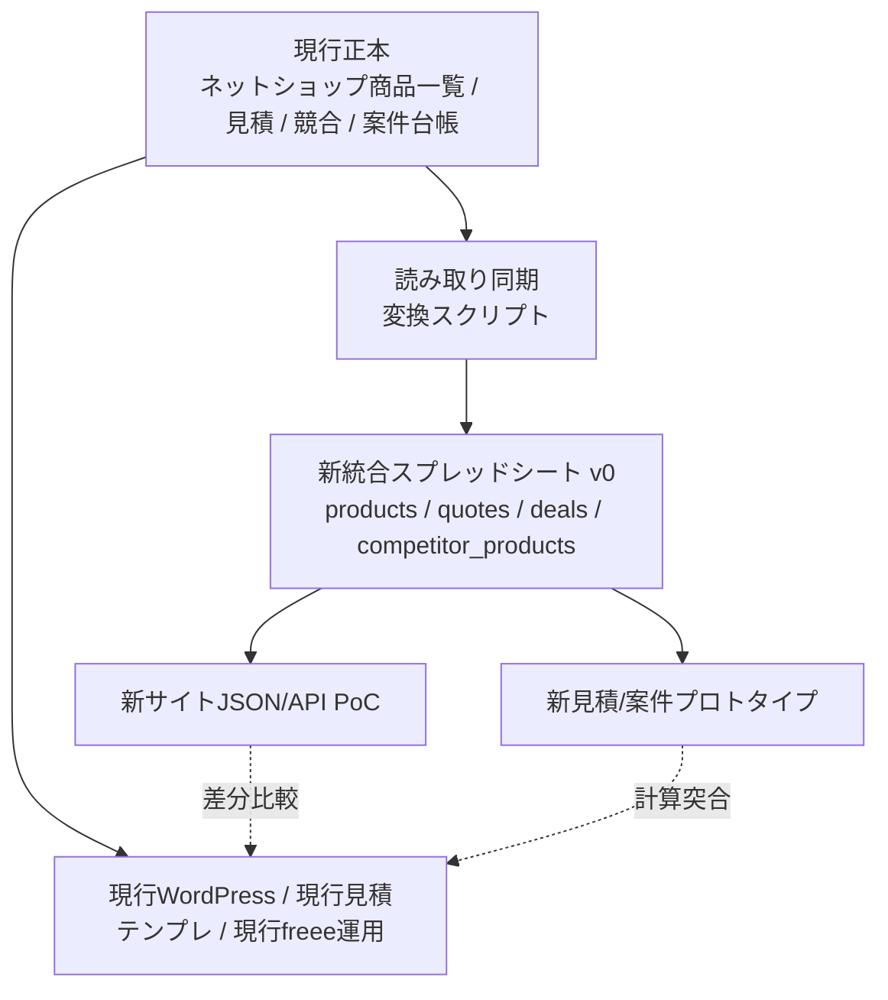

# 移行方針（現行維持・並行運用・段階移行）

最終更新: 2026-04-04

## 基本方針

- 現行シート・現行GAS・現行WordPress運用は、移行先が検証できるまで止めない
- 既存シートや既存GASは削除しない
- 役割が不明なタブ/ブックは `要確認` として扱い、即削除しない
- 新システムは別プロジェクト・別データ層として設計し、現行正本から段階的に読み取り同期する
- 商品マスタ、見積連動、競合価格データは新システムでも残す
- WordPress 専用構造は、新システムの中核データモデルへそのまま持ち込まない

## 移行フェーズ案

| フェーズ | 目的 | 主な作業 | 成果物/完了条件 | 現行運用への影響 |
|---|---|---|---|---|
| Phase 0 棚卸し | 現行の正本候補、依存関係、未解決事項を把握する | シート棚卸し、GAS責務整理、構成図作成、未解決事項整理 | `docs/current-system-overview.md`、`docs/sheet-inventory.md`、`docs/gas-responsibility-map.md`、`docs/open-questions.md` | なし。読み取り中心 |
| Phase 1 正本確定 | どのブック/タブを新システムの入力元にするか決める | 商品マスタ正本、見積テンプレ正本、競合データ正本、案件台帳正本の確定、旧コピーの位置づけ整理 | 正本一覧、旧コピー/アーカイブ方針、商品コード仕様書 | なし〜軽微 |
| Phase 2 新データモデル設計 | WordPressなしの業務データ構造を確定する | `products`、`product_media`、`quotes`、`quote_lines`、`deals`、`competitor_products` 等の列定義 | 新統合スプレッドシート v0 のタブ/列定義、JSONスキーマ案 | なし |
| Phase 3 並行同期基盤 | 現行正本を壊さず、新データ層へ読み取り同期する | 現行商品マスタ/見積/競合/案件台帳から新シートへ変換コピー、差分チェック | 新統合スプレッドシート v0、同期スクリプト、差分チェックレポート | 現行は維持。読み取り負荷のみ注意 |
| Phase 4 新サイトPoC | WordPressなしで商品一覧/詳細を表示できる最小版を作る | 公開商品JSON/API生成、一覧/詳細画面PoC、画像表示、公開状態反映 | 新サイトPoC、現行サイトとの商品表示差分表 | 現行サイトは継続 |
| Phase 5 見積・案件移行 | 商品マスタ連動見積、送料/値引き、freee/Gmail連携を新構造へ寄せる | 見積ヘッダ/明細化、値引き/運搬費ルール移植、案件台帳連携、freee連携置換 | 新見積プロトタイプ、旧テンプレートとの計算突合表 | 並行運用。帳票差分検証が必要 |
| Phase 6 競合価格基盤再構築 | 競合収集・分類・価格比較を新スキーマへ載せ替える | 競合データ正規化、分類マップ修正、画像保存ルール整理、価格比較ビュー | `competitor_products` データ、分類マッピング、価格比較ダッシュボード案 | 現行競合シートは参照維持 |
| Phase 7 段階切替 | 一部業務から新サイト/新管理へ切り替える | 商品掲載チャネルの切替、見積作成の一部案件移行、運用手順更新 | 切替手順書、ロールバック手順、権限設計 | 中。必ず旧系統へ戻せる状態で実施 |
| Phase 8 旧構造アーカイブ | 旧WordPress前提出力や旧コピーを履歴化する | 旧コピー凍結、不要リンク整理、旧テンプレートの読み取り専用化、GASトリガー棚卸し | アーカイブ一覧、停止済みGAS一覧、最終運用ドキュメント | 中。停止対象の確認が必須 |

## 並行運用の考え方

## リスクと対策

| リスク | 内容 | 対策 |
|---|---|---|
| 正本ブック誤認 | 旧コピーやバックアップを正本として扱うとデータがずれる | 更新日時、実運用ヒアリング、GAS参照先、リンク元を照合して Phase 1 で正本確定する |
| GAS未取得 | 商品コード生成やWordPress反映の実装が見えないまま設計すると仕様漏れする | Apps Script エディタから scriptId/.gs/トリガーを必ず取得し、責務表を更新する |
| WordPress構造の持ち込み | `post_id` やWPカテゴリ列を新商品マスタ本体に混ぜると再びCMS依存になる | 業務マスタとチャネル出力を分離し、WordPress互換は移行用アダプタに閉じ込める |
| 見積計算の劣化 | 台数値引き、送料、運搬設置費、手数料、税計算の再現漏れ | 現行テンプレートと新計算結果の突合テストを作り、案件サンプルで比較する |
| 固定列/固定セル依存 | 現行GASや数式が `Q列`、`G12` のような固定位置に依存 | 新構造では列名/ID参照へ寄せ、現行互換層だけに固定位置変換を閉じ込める |
| 個人情報の混在 | 顧客希望商品、見積、給与明細などが同一ブック群に混在 | 新システムではドメイン分離と閲覧権限分離を設計し、調査ドキュメントにも個人情報値を転記しない |
| 競合データ品質 | `メーカー分類` の `#ERROR!` や中継ブック重複で分析が不安定 | 元データ、分類変換、中継の役割を整理し、正規化パイプラインを再設計する |
| タイムゾーンずれ | 商品マスタブックが `America/Los_Angeles` 設定 | 新システムでは Asia/Tokyo 基準に統一し、移行時に日時変換ルールを明示する |
| 旧リンク切れ | 旧見積テンプレートIDが 404 のように参照欠損がある | リンク棚卸しを行い、必要な旧資料は代替先を登録する |

## 移行前に確定すべき判断

| 論点 | 選択肢/確認事項 | 推奨 |
|---|---|---|
| 商品マスタ正本 | `ネットショップ商品一覧2018-10-22` が正本か、別ブックが正本か | まず `ネットショップ商品一覧2018-10-22` を正本候補として検証し、他コピーとの差分を確認 |
| BASE継続 | BASE出品を新システムでも残すか | 残すならチャネル出力として分離。不要なら Phase 8 でアーカイブ |
| 見積正本 | `見積もりテンプレート2.3`、`2.3freee連携API`、案件別見積集約のどれが現行正本か | 実運用で新規案件作成に使っているテンプレートを1つ確定 |
| 競合収集範囲 | リサイフィット以外も継続収集するか | まず現行 `リサイフィット` を正規化し、追加サイトは後段 |
| 管理UI優先度 | スプレッドシート維持か、早期Web管理画面化か | 商品マスタ正規化が先。管理Webは Phase 4 以降で段階導入 |

## 今回わかったこと

- 現行維持しながら新データ層を並行構築する方針が現実的で、特に商品マスタ/見積/競合/案件台帳の正本確定が最初の山になる。
- WordPress 置換そのものより先に、WordPress前提列と業務マスタ列の分離、見積/案件の明細データ化、競合データ正規化が必要。
- 旧リンク切れ、分類エラー、GAS未取得、個人情報混在は移行前のリスクとして明示的に潰す必要がある。

## まだ不明なこと

- 各ブックの正本/旧版/試作の運用上の位置づけ
- コンテナバインドGASの中身とトリガー
- 現行WordPress反映の実運用手順
- 新サイト切替時に残すチャネルと業務スコープの優先順位

## 次の一手

1. `docs/open-questions.md` の高優先度項目から、GAS取得と正本確認を先に潰す。
2. 新統合スプレッドシート v0 の列定義を作り、現行正本からの変換マッピング表を作る。
3. 商品一覧/詳細の新サイト PoC に必要な最小商品フィールドを確定する。

## すぐ着手できる実装候補

- 現行商品マスタから新 `products` / `product_media` / `channel_settings` へ変換するマッピングCSVの作成
- 見積計算突合用のサンプル案件セット作成
- 競合データの分類エラー調査と、正規化マップの初版作成
- 新サイトPoC向け `products.json` 生成スクリプトの設計
