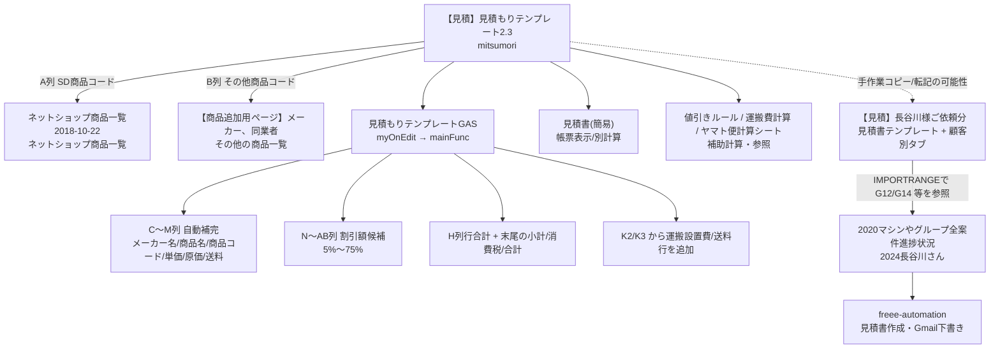

# 現行見積フロー整理（正本・派生・旧運用の切り分け）

最終更新: 2026-04-04

## 目的

現行の見積作成フローを、入力補助・計算・帳票・案件台帳/freee連携の観点で整理し、どのシート/ブックを新システムへ優先移植すべきかを判断できる状態にする。

## 現行見積フロー図

## 現行フローの段階整理

| 段階 | 正本候補/主要シート | 何をしているか | 確認できたこと | 未確定のこと |
|---|---|---|---|---|
| 商品コード入力補助 | `【見積】見積もりテンプレート2.3` / `mitsumori` | A列/B列に商品コードを入れて商品情報を自動展開 | `myOnEdit(e)` が A/B/G/J/K列編集時に `mainFunc()` を起動。A列はSD商品、B列はその他商品を引く | この `mitsumori` が日常業務の入力正本として今も使われているか、`2.3freee連携API` との使い分け |
| SD商品参照 | `ネットショップ商品一覧2018-10-22` / `ネットショップ商品一覧` | A列SD商品コードからメーカー名・商品名・商品コード・販売価格・原価・送料を取得 | `setMatchDatas2()` が商品一覧の `新規自動生成商品コード` を検索し、列番号固定で値を転記 | 商品一覧側の列変更が過去にどう管理されていたか |
| その他商品参照 | `【商品追加用ページ】メーカー、同業者` / `その他の商品一覧` | B列コードからメーカー/同業者商品を取得 | `setMatchDatas()` が品番、商品名、定価、仕入値、メーカー名を転記 | `TEST商品` / `画像` タブの運用、その他商品マスタの正本性 |
| 値引き計算 | `mitsumori` + `見積もりテンプレートGAS.txt` + `値引きルール` | J列の値引き額を反映し、割引候補列も表示 | `setEachSum()` が J列の値引き額を引いて F列単価と H列行合計を再計算。`setMatchDatas*()` が N〜AB列へ 5%〜75% の割引額候補を埋める | `値引きルール` シートはGASから直接参照されておらず、手入力判断用か要確認 |
| 送料/運搬設置費 | `mitsumori` + `運搬費計算` + `ヤマト便計算シート` | 送料または運搬設置費を見積末尾へ追加 | `getShippingFee()` は K2=運搬設置費、K3=送料 として判定し、末尾行へ1行追加する | `運搬費計算` / `ヤマト便計算シート` の結果を K2/K3 に手で写すのか、自動連動があるのか未確認 |
| 小計/税/合計 | `mitsumori` | 行合計を合算して末尾に小計/消費税/合計を出す | `getFinalSum()` が H列を合算し、税10%、税込合計を計算。既存の `小計` 行がある場合は再生成しない設計 | 8%/10%混在案件の扱いは `見積書テンプレート` 側に別ロジックがあり、どちらが正か未確定 |
| 帳票化/案件別保管 | `【見積】長谷川様ご依頼分` / `見積書テンプレート` + 顧客別タブ | 顧客提出版の見積書を案件別タブとして保存 | `2024長谷川さん` から顧客別タブの `G12` / `G14` 等を `IMPORTRANGE` しているため、案件別タブが金額参照元になっていることは確認済み | `mitsumori` から顧客別タブへどうコピーするか、日常の手順は未確認 |
| 案件台帳/freee連携 | `2024長谷川さん` + `freee-automation` | 顧客名・案件内容・lines_json・freee quotation_id・メール下書きを管理 | `freee-automation` が `2024長谷川さん` と `lines_json作成` を直接参照 | 案件台帳の正本列と顧客別見積タブの更新順序 |

## 正本 / 派生 / 旧運用 の分類

| ブック/シート | 分類 | 根拠 | 残すべき機能 | 備考 |
|---|---|---|---|---|
| `【見積】見積もりテンプレート2.3` / `mitsumori` | 入力補助・計算の正本候補 | `見積もりテンプレートGAS.txt` が `mitsumori` タブ名を前提に自動補完/再計算する | 商品コードからの行自動展開、値引き候補表示、行合計/小計/税/合計再計算、送料/運搬設置費追加 | 実運用で `2.3` と `2.3freee連携API` のどちらを起点にしているかは要確認 |
| `【見積】見積もりテンプレート2.3` / `見積書(簡易)` | 帳票表示の補助シート | 商品入力より帳票レイアウトとセル式が中心 | 最終見積書レイアウト、品目・数量・単価・税・合計表示 | GAS処理対象外。新システムでは帳票テンプレートとして分離候補 |
| `【見積】見積もりテンプレート2.3` / `運搬費計算` | 補助計算シート | 距離・燃費・高速代・人件費・車代の計算式を持つ | 運搬設置費計算 | `mitsumori` への自動反映有無は未確認 |
| `【見積】見積もりテンプレート2.3` / `値引きルール` | 補助ルール表 | 台数別値引き率を保持 | 標準値引きルール | GASは直接参照していないため、手動参照の可能性 |
| `【見積】見積もりテンプレート2.3` / `旧見積もりシート` | 旧運用 | シート名に旧版が明示 | 過去互換が必要なら履歴参照のみ | 新規運用の正本にはしない方針 |
| `【見積】見積もりテンプレート2.3` / `空白シート`、`シート10` | 要確認 | テンプレ/空欄/予備タブに見える | 不明 | `シート10` は空に見えるためアーカイブ候補 |
| `【見積】見積もりテンプレート2.3freee連携API` | 派生版 / 要確認 | `mitsumori` はあるが、通常版2.3との正本関係が未確定 | freee連携前提の派生仕様があれば抽出 | まず scriptId とコード差分の確認が必要 |
| `【見積】長谷川様ご依頼分` / `見積書テンプレート` | 案件別帳票の雛形 | 顧客別タブが多数あり、台帳から `IMPORTRANGE` されている | 顧客提出版の見積帳票テンプレート、税率別集計 | `mitsumori` 系GASの直接対象ではない可能性が高い |
| `【見積】長谷川様ご依頼分` / 顧客別タブ | 案件別コピー/履歴の正本候補 | `2024長谷川さん` がタブ別セルを参照している | 案件ごとの提出版見積保存 | 個人名タブ増殖のため、新システムでは `quote_headers` / `quote_lines` 化したい |
| `2020マシンやグループ全案件進捗状況` / `2024長谷川さん` | 案件台帳の正本候補 | freee-automation が直接読み書きする | 案件状態、見積リンク、請求/入金、freee ID、Gmail状態 | 見積金額の一部は顧客別タブから `IMPORTRANGE` |
| `【商品追加用ページ】メーカー、同業者` / `その他の商品一覧` | その他商品マスタ正本候補 | 見積B列自動補完の直接参照元 | SD商品以外の定番品・同業者品マスタ | 新システム商品マスタへ統合するか、別商品種別として残すか要検討 |

## 現在も使っている見積フローの仮説

### 実際に確認できたこと

1. `mitsumori` タブで A/B/G/J/K列を編集すると、`myOnEdit` → `mainFunc` が動き、商品情報・割引候補・行合計・小計/税/合計を再生成する。
2. A列SD商品コードの参照元は `ネットショップ商品一覧2018-10-22`、B列その他商品コードの参照元は `【商品追加用ページ】メーカー、同業者`。
3. `2024長谷川さん` は `【見積】長谷川様ご依頼分` の顧客別タブから見積金額を `IMPORTRANGE` で参照する。
4. freee見積作成・Gmail下書きは `2024長谷川さん` を起点に `freee-automation` が処理する。

### 推測

- 日々の見積作成は、まず `見積もりテンプレート2.3` の `mitsumori` で商品行と金額を組み、必要に応じて `長谷川様ご依頼分` の顧客別タブへコピー/転記し、案件台帳 `2024長谷川さん` で進捗とfreee連携を管理している可能性が高い。
- ただし、`mitsumori` から `長谷川様ご依頼分` へ移す操作が手作業なのか、別GASがあるのかは未確認。

## 現行の脆い点

| 脆い点 | 内容 | 新システムでの置き換え方針 |
|---|---|---|
| タブ名依存 | `isGoodSheet()` が `mitsumori` を含むタブだけ処理対象にする | シート名ではなく明示的な見積ID/シート種別で判定する |
| 列番号固定 | 商品一覧は `新規自動生成商品コード` が15列目、原価が25列目、送料が26列目など、コードに列番号が直書き | 列名/スキーマ定義を1箇所に持ち、固定列直書きをやめる |
| 商品名文字列から価格復元 | `商品名（現状価格xxx円）` を split して単価を再計算 | 表示名と価格データを分離し、金額は数値列から計算する |
| K2/K3固定セル | 運搬設置費/送料の入力場所が固定 | 見積ヘッダの `shipping_fee` / `installation_fee` など明示列にする |
| 値引きルールが分散 | `値引きルール` シートはあるが、GASはJ列の値引き額を直接使い、割合候補はN〜AB列へベタ書き | 値引きルールテーブルと適用結果を分離し、手動割引と自動提案を区別する |
| 案件別タブ増殖 | 顧客ごとの見積がタブとして増える | `quote_headers` / `quote_lines` で案件IDベースに管理し、帳票はビューで出す |
| 台帳と帳票が `IMPORTRANGE` で疎結合 | 顧客別タブの固定セル変更で台帳金額が壊れる | 同一データモデルから帳票と台帳を生成する |

## 今後残すべき機能

- SD商品コード/その他商品コードからの見積明細自動補完
- 原価・送料・割引候補を見ながら見積額を調整できる仕組み
- 運搬設置費/送料を見積合計に加算する仕組み
- 小計/消費税/合計の自動計算
- 顧客提出用の見積書テンプレート
- 案件台帳と freee/Gmail 連携

## いま不要そうな見積シート

| シート | 判定 | 理由 |
|---|---|---|
| `旧見積もりシート` | 旧運用 | 現行GASの対象外で、旧版と明示されている |
| `シート10` | 要確認だがアーカイブ候補 | A1:Z40 が空で、用途が見えていない |
| `買取明細書・領収書 のコピー` | アーカイブ候補 | コピー名から複製版であり、正本帳票ではなさそう |

## 今回新たに確定したこと

- 見積テンプレートの実行トリガーは `myOnEdit` のインストール型 onEdit で、`createTrigger()` が初回セットアップを担う。
- A列SD商品コードとB列その他商品コードで参照元ブックが分かれている。
- `mitsumori` タブが見積入力/自動計算の中心で、`長谷川様ご依頼分` は案件別帳票の保存先/参照元として別役割を持つ。

## まだ未確定のこと

- 実運用で `【見積】見積もりテンプレート2.3` と `2.3freee連携API` のどちらを新規見積の起点として使っているか
- `mitsumori` の完成内容を `長谷川様ご依頼分` 顧客別タブへどう移すかの手順
- `運搬費計算` / `ヤマト便計算シート` / `値引きルール` をどの順で見て K列/J列を確定しているか

## 設計に進めるようになった項目

- `quotes` / `quote_lines` / `quote_adjustments` / `shipping_charges` の初期列設計
- SD商品マスタとその他商品マスタを統合または分離する判断の論点整理

## 次の一手

1. 現場の1件の見積作成手順を、どのブックを開き、どのタブをコピーし、どこへ転記しているかまで通しで確認する。
2. `2.3` と `2.3freee連携API` の Apps Script 差分と利用頻度を確認する。
3. 見積の正本データを `mitsumori` 由来にするか、案件別タブ由来にするかを決める。

## すぐ実装着手できる候補

- 現行 `mitsumori` から `quote_lines` へ写す列マッピング表
- `その他の商品一覧` を `products` に統合するか `external_products` として分けるかのスキーマ案
- 見積計算の最小再現テストケース作成
