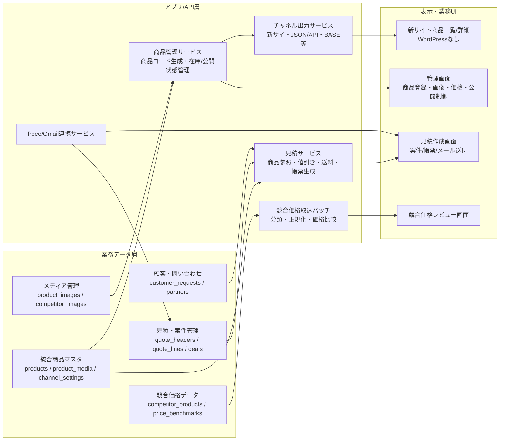

# WordPressなし前提の新システム構成案（たたき台）

最終更新: 2026-04-04

## 目的

現行の中古マシン販売業務の前提を崩さず、WordPress を使わない次世代システムへ移行するための初期アーキテクチャ案を整理する。

## 設計方針

- 商品マスタは新システムでも中核として維持する
- 商品コード、見積、競合価格、freee連携、画像管理の業務連動は残す
- WordPress 専用列や投稿構造は新しい商品マスタ本体へ持ち込まず、必要ならチャネル別出力として分離する
- 現行スプレッドシート運用はすぐ止めず、まず並行運用しながら新データモデルを固める
- 初期は Markdown + 統合スプレッドシート + 軽量 JSON/API から始め、いきなり大規模DB化しない

## 新しい全体構成案

## 必要なデータ層

### 商品ドメイン

| テーブル/シート案 | 主な項目 | 役割 |
|---|---|---|
| `products` | 商品ID、SD商品コード、メーカーID、商品名、状態、店舗、仕入年、部位カテゴリ、商品カテゴリ、説明、サイズ、重量、原価、送料、売価、割引後価格、公開状態、仕入先、販売日、販売先、作成/更新日時 | 商品マスタ本体 |
| `product_media` | 商品ID、画像番号、画像URL/Drive ID、alt、並び順、公開フラグ | 商品画像管理 |
| `product_channel_listing` | 商品ID、チャネル種別、新サイト公開フラグ、BASE公開フラグ、チャネル別カテゴリ、チャネル別タイトル、チャネル別説明 | 掲載チャネル別の差分管理 |
| `code_master_location` | 店舗名、店舗コード | 商品コード生成マスタ |
| `code_master_maker` | メーカー名、メーカーコード、表記ゆれ | 商品コード生成/メーカー正規化 |
| `code_master_category` | 部位コード、部位名、大カテゴリ、サイトカテゴリ | 分類マスタ |
| `code_master_status` | 状態名、公開状態、販売終了扱い、サイト表示ラベル | 状態マスタ |

### 見積・案件ドメイン

| テーブル/シート案 | 主な項目 | 役割 |
|---|---|---|
| `deals` | 案件ID、顧客ID、案件名、発生日、状態、担当者、見積ID、受注日、請求日、入金日、納品日、備考、freee partner_id、freee quotation_id、Gmail Message-ID | 案件進捗台帳 |
| `quote_headers` | 見積ID、案件ID、宛名、件名、小計、税額、合計、値引き合計、運搬設置費合計、支払額、帳票URL、作成/更新日時 | 見積ヘッダ |
| `quote_lines` | 見積行ID、見積ID、商品ID、SD商品コード、品名、数量、単価、値引率、値引後単価、行金額、原価、送料、税率、備考 | 見積明細 |
| `quote_adjustment_rules` | 条件種別、最小台数、最大台数、値引率、適用優先度、有効フラグ | 値引きルール |
| `logistics_cost_rules` | 地域、距離帯、作業人数、車種、燃費、高速代、基本料金、計算式バージョン | 運搬設置費ロジック |
| `repair_cost_templates` | 作業種別、メーカー、型番、部位、部材、標準工数、材料単価、利益率 | 修理/張替え原価計算 |
| `customer_requests` | 問い合わせID、顧客名、メール、希望商品1-3、自由記述、受付日時、案件化状態 | 希望商品問い合わせ |

### 競合価格ドメイン

| テーブル/シート案 | 主な項目 | 役割 |
|---|---|---|
| `competitor_sources` | ソースID、サイト名、一覧URL、取得方式、利用可否、最終取得日時 | 競合サイト定義 |
| `competitor_products` | 競合商品ID、ソースID、取得日時、URL、商品名、メーカー名、整備価格、現状価格、説明、カテゴリ、画像URL、正規化商品カテゴリ、正規化メーカーID | 競合商品スナップショット |
| `competitor_taxonomy_map` | 元カテゴリ/元メーカー表記、正規化カテゴリ/メーカー、ルール種別、優先度 | 表記ゆれ・分類マッピング |
| `price_benchmarks` | 商品ID/カテゴリID、競合商品ID、比較価格、価格差、判定メモ、更新日時 | 価格判断補助 |

## 必要な管理画面 / 管理方式

| 管理領域 | 初期案 | 理由 |
|---|---|---|
| 商品登録・編集 | まず統合スプレッドシート + バリデーション、次段階で管理Web画面 | 現行運用を壊さず、商品コード体系と入力項目を先に固めやすい |
| 画像管理 | Drive フォルダ + `product_media` 台帳、後でアップロードUI | 現行のDrive画像運用と接続しやすい |
| 見積作成 | 初期はスプレッドシート補助 + JSON化、次に見積Web画面 | 現行の帳票運用を残しつつ、行明細データ構造を先に正規化できる |
| 案件進捗 | `deals` 台帳シート + freee状態同期 | 現行 `2024長谷川さん` の固定列運用を安全に置き換える前段 |
| 競合価格レビュー | 競合データシート + 差分/分類チェック列、後でレビュー画面 | スクレイピング結果と人手確認を分離しやすい |

## 新しい統合スプレッドシート構成案 v0

まずは新システム専用の別スプレッドシートを 1 つ作り、現行正本を壊さず並行検証できる形にする。

| タブ名案 | 内容 | 現行からの対応 |
|---|---|---|
| `products` | 商品マスタ本体 | `ネットショップ商品一覧` |
| `product_media` | 商品画像一覧 | 商品画像列、Drive画像URL |
| `channel_settings` | 新サイト/BASE等のチャネル別公開設定 | `Wordpress用csv`、`BASE用csv` のうち業務上必要な部分 |
| `maker_master` | メーカーコード/表記ゆれ | `ルール` |
| `location_master` | 店舗コード | `ルール` |
| `category_master` | 部位コード/カテゴリ | `ルール`、WordPressカテゴリ列の業務カテゴリ部分 |
| `status_master` | 状態と公開制御 | `ルール`、公開状態列 |
| `quotes` | 見積ヘッダ | `mitsumori`、案件別見積タブ |
| `quote_lines` | 見積明細 | `mitsumori`、案件別見積タブ |
| `discount_rules` | 値引きルール | `値引きルール` |
| `logistics_rules` | 運搬設置費ルール | `運搬費計算`、`ヤマト便計算シート` |
| `deals` | 案件進捗 | `2024長谷川さん`、`2020兵庫案件`、`2024廃棄処理` |
| `competitor_products` | 競合商品データ | `STRONGDEPOT 競合サイトデータ`、`他社競合データ` |
| `competitor_mapping` | メーカー/カテゴリ正規化 | `競合サイトデータまとめ` |
| `open_questions` | 移行中の保留事項 | 現行に散らばる運用メモ |

## サイト表示層の考え方

WordPress をやめる前提では、商品マスタから新サイト表示用データを生成する層を CMS 投稿構造から切り離す。

### 案A: 静的サイト + 商品JSON

- `products` から公開対象だけ JSON を生成し、フロントエンドで一覧/詳細を表示する
- 初期構築が軽く、WordPress 依存を外しやすい
- 管理画面はスプレッドシートまたは別UIで担当する

### 案B: フロントエンド + 軽量API

- 商品検索、詳細、問い合わせ、在庫状態を API 経由で返す
- 管理UIや見積機能と将来統合しやすい
- ただし認証、検索、画像配信、デプロイ設計が必要

### 案C: Headless CMS + 独自業務DB

- 表示コンテンツは Headless CMS、商品/見積/競合は独自データ層で管理
- 記事系コンテンツが多いなら有効だが、今回の中核は商品・見積・競合なので最初からCMS導入ありきにしない方がよい

### 現時点の推奨

初期は `案A` または `案B` 寄りで、まず商品マスタ正規化と商品JSON/API出力を作る。記事CMSは必要性が明確になってから追加検討する。

## API / JSON / DB をどこまで使うか

| 段階 | 推奨構成 | 狙い |
|---|---|---|
| 段階1 | 新統合スプレッドシート + JSONエクスポート | 現行運用を壊さず新サイト表示データを作る |
| 段階2 | 商品/見積/案件/競合の読み取りAPI + 管理シート | フロントと業務データ構造を分離する |
| 段階3 | 書き込み系API + DB化 | 同時編集、権限、履歴、検索性能、監査性を上げる |

最初から全領域をDBへ移すより、`商品マスタ` と `見積・案件` と `競合価格` の境界を先に固め、変換しやすい JSON スキーマを作る方が安全。

## 現行から新システムへの移行ステップ

1. `ネットショップ商品一覧2018-10-22` と見積/競合/案件台帳の正本タブを確定する。
2. 商品コード体系、見積計算ルール、配送/値引きルール、競合分類ルールを仕様としてMarkdown化する。
3. 新システム専用の統合スプレッドシート v0 を作り、現行正本から読み取り同期する。
4. `products` + `product_media` + `channel_settings` から新サイト用 JSON を生成する。
5. 新サイトの一覧/詳細 PoC を WordPress なしで作り、現行サイトと並行表示して差分確認する。
6. 見積・案件・freee連携を新データモデルへ段階的に写し、旧テンプレート依存を減らす。
7. 競合価格取込と分類を新スキーマへ載せ替え、価格比較ビューを作る。
8. 現行WordPress出力/旧テンプレート/旧コピーシートをアーカイブし、最終的に新サイトへ切り替える。

## 今回わかったこと

- 現行の中核は `商品マスタ`、`見積/案件`、`競合価格` の3領域で、ここを分けて設計すれば WordPress を外しても業務前提を維持しやすい。
- WordPress 固有の投稿・カテゴリ・公開列は「商品そのもの」ではなく「チャネル別掲載設定」として外出しするのが自然。
- すぐ全面DB化するより、まず新しい統合スプレッドシートと JSON/API 境界を作る方が安全に並行移行できる。

## まだ不明なこと

- 新サイトに必要な検索条件、カテゴリ階層、SEO要件、問い合わせ導線、在庫表示ルール
- BASE を新システムでも継続するか、どのチャネルを初期対応に入れるか
- 競合価格データをどこまで自動で価格提案へ使うか、人手承認をどこに入れるか
- 新管理画面を最初からWebで作るか、当面スプレッドシート運用を残すかの優先順位

## 次の一手

1. 新統合スプレッドシート v0 のタブ定義と列定義を作る。
2. `products` と `quote_lines` と `competitor_products` の JSON スキーマ案を先に確定する。
3. WordPress不要の新サイト PoC で最低限必要な公開商品フィールドを決める。

## すぐ着手できる実装候補

- 新サイト用 `products.json` のスキーマ設計と、現行 `ネットショップ商品一覧` からの変換仕様書作成
- `SD商品コード` 分解/生成ロジックのサービス化設計
- 見積ヘッダ/明細/値引き/送料を分けた `quotes` / `quote_lines` データモデルの試作
- `STRONGDEPOT 競合サイトデータ` を `competitor_products` 形式へ正規化する変換マッピング表作成
